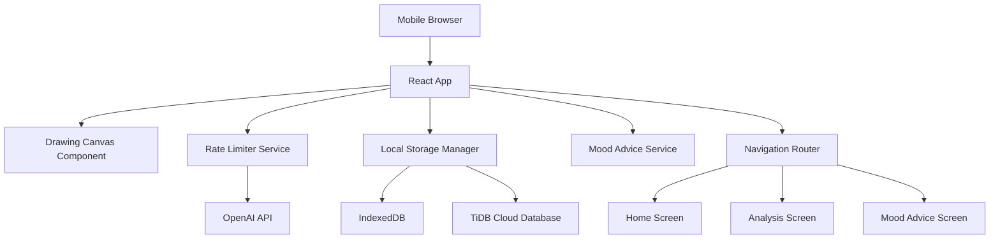

# Design Document

## Overview

The mood drawing app is a mobile-first React application that enables users to express emotions through touch-based drawing, analyzes mood patterns using AI, and provides personalized mood improvement advice and wellness guidance. The system implements strict API rate limiting to maintain operational costs within defined budgets while providing a smooth user experience focused on emotional well-being.

## Architecture

### High-Level Architecture



### Technology Stack

- **Frontend Framework**: React 18 with functional components and hooks
- **Build Tool**: Vite for fast development and optimized builds
- **Routing**: React Router DOM for single-page application navigation
- **Canvas API**: HTML5 Canvas for touch-based drawing functionality
- **Local Storage**: IndexedDB for persistent data storage and API quota tracking
- **HTTP Client**: Fetch API for external API communications
- **Styling**: CSS modules with mobile-first responsive design

### API Integration Strategy

- **OpenAI API**: GPT-4 Vision for mood analysis from drawing images (50 calls/day limit)
- **TiDB Cloud**: Optional mood history storage and trend analysis
- **Rate Limiting**: Client-side quota management with daily reset mechanism
- **Error Handling**: Graceful degradation when quotas are exceeded with local fallbacks

## Components and Interfaces

### Core Components

#### 1. DrawingCanvas Component
```javascript
interface DrawingCanvasProps {
  onDrawingComplete: (imageData: string) => void;
  onClear: () => void;
}

interface DrawingState {
  isDrawing: boolean;
  currentColor: string;
  brushSize: number;
  canvasData: ImageData;
}
```

**Responsibilities:**
- Render touch-responsive HTML5 canvas
- Handle multi-touch drawing events
- Provide drawing tools (color picker, brush size, clear)
- Export canvas as base64 image data
- Optimize image size for API transmission

#### 2. RateLimiter Service
```javascript
interface RateLimiterConfig {
  openaiDailyLimit: 50;
  tidbDailyLimit: 1000;
}

interface ApiQuota {
  service: string;
  used: number;
  limit: number;
  resetTime: Date;
}

class RateLimiter {
  checkQuota(service: string): boolean;
  incrementUsage(service: string): void;
  getRemainingQuota(service: string): number;
  resetDailyCounters(): void;
  getQuotaWarning(service: string): string | null;
}
```

**Responsibilities:**
- Track daily API usage for OpenAI and TiDB services
- Prevent API calls when quotas are exceeded
- Reset counters at midnight local time
- Persist quota data in IndexedDB
- Provide quota status and warnings to UI components

#### 3. MoodAnalysisService
```javascript
interface MoodAnalysisRequest {
  imageData: string;
  timestamp: Date;
}

interface MoodAnalysisResult {
  primaryMood: string;
  confidence: number;
  emotions: Array<{name: string, intensity: number}>;
  description: string;
  adviceCategories: string[];
  timestamp: Date;
}

class MoodAnalysisService {
  analyzeMood(imageData: string): Promise<MoodAnalysisResult>;
  formatImageForAPI(canvas: HTMLCanvasElement): string;
}
```

**Responsibilities:**
- Convert canvas to optimized image format
- Send requests to OpenAI GPT-4 Vision API
- Parse and structure mood analysis responses
- Map moods to appropriate advice categories
- Handle API errors and quota limitations

#### 4. MoodAdviceService
```javascript
interface MoodAdvice {
  category: string;
  title: string;
  description: string;
  actionSteps: string[];
  techniques: string[];
  duration: string;
  difficulty: 'easy' | 'medium' | 'advanced';
}

interface AdviceRecommendation {
  mood: string;
  intensity: number;
  advice: MoodAdvice[];
  personalizedMessage: string;
}

class MoodAdviceService {
  getAdviceForMood(moodResult: MoodAnalysisResult): AdviceRecommendation;
  getAdviceDatabase(): Map<string, MoodAdvice[]>;
  personalizeAdvice(advice: MoodAdvice[], userHistory?: MoodAnalysisResult[]): MoodAdvice[];
  cacheAdvice(advice: AdviceRecommendation): void;
}
```

**Responsibilities:**
- Maintain comprehensive mood improvement advice database
- Map detected moods to appropriate advice categories
- Personalize recommendations based on mood intensity and history
- Provide actionable steps and techniques for emotional well-being
- Cache advice for offline access

#### 5. LocalStorageManager
```javascript
interface UserSession {
  sessionId: string;
  drawings: Array<{imageData: string, timestamp: Date}>;
  moodHistory: MoodAnalysisResult[];
  preferences: UserPreferences;
}

interface ApiUsageLog {
  date: string;
  openaiCalls: number;
  tidbOperations: number;
}

interface MoodTrend {
  period: 'week' | 'month' | 'year';
  averageMood: string;
  moodFrequency: Map<string, number>;
  improvementSuggestions: string[];
}

class LocalStorageManager {
  saveSession(session: UserSession): Promise<void>;
  loadSession(): Promise<UserSession>;
  logApiUsage(service: string): Promise<void>;
  getApiUsage(date: string): Promise<ApiUsageLog>;
  saveMoodToTiDB(moodResult: MoodAnalysisResult): Promise<void>;
  getMoodTrends(period: string): Promise<MoodTrend>;
  clearOldData(daysToKeep: number): Promise<void>;
}
```

**Responsibilities:**
- Persist user sessions and mood history locally and in TiDB
- Track API usage across app restarts
- Manage IndexedDB and TiDB operations within daily limits
- Generate mood trends and analytics from historical data
- Provide offline functionality with local fallbacks

### Screen Components

#### 1. HomeScreen
- Welcome message and app introduction
- "Start Drawing" button to begin mood analysis
- Display remaining daily quotas
- Access to previous mood history

#### 2. AnalysisScreen
- Embedded DrawingCanvas component
- Real-time drawing feedback
- Submit button for mood analysis
- Loading state during API processing
- Error handling for quota exceeded

#### 3. MoodAdviceScreen
- Display mood analysis results with emotional insights
- Show personalized mood improvement advice and techniques
- Provide actionable steps organized by category (breathing, activities, etc.)
- Display mood history trends when available
- "Start New Drawing" button to restart process
- Offline mode with cached advice recommendations

## Data Models

### Mood Analysis Data Model
```javascript
const MoodSchema = {
  id: String,
  timestamp: Date,
  imageData: String, // Base64 encoded canvas image
  analysis: {
    primaryMood: String,
    confidence: Number,
    emotions: [{
      name: String,
      intensity: Number // 0-1 scale
    }],
    description: String,
    adviceCategories: [String]
  },
  advice: [{
    category: String,
    title: String,
    description: String,
    actionSteps: [String],
    techniques: [String],
    duration: String,
    difficulty: String
  }],
  userFeedback: {
    helpful: Boolean,
    completedActions: [String],
    notes: String
  }
}
```

### Mood Advice Database Model
```javascript
const AdviceDatabaseSchema = {
  anxiety: [{
    title: "Deep Breathing Exercise",
    description: "Calm your nervous system with controlled breathing",
    actionSteps: ["Find a quiet space", "Breathe in for 4 counts", "Hold for 4 counts", "Exhale for 6 counts"],
    techniques: ["4-7-8 breathing", "Box breathing", "Belly breathing"],
    duration: "5-10 minutes",
    difficulty: "easy"
  }],
  sadness: [{
    title: "Gentle Movement",
    description: "Light physical activity to boost mood naturally",
    actionSteps: ["Step outside", "Take a 10-minute walk", "Focus on surroundings", "Practice gratitude"],
    techniques: ["Walking meditation", "Nature observation", "Gratitude practice"],
    duration: "10-20 minutes", 
    difficulty: "easy"
  }],
  stress: [{
    title: "Progressive Muscle Relaxation",
    description: "Release physical tension to reduce mental stress",
    actionSteps: ["Lie down comfortably", "Tense each muscle group", "Hold for 5 seconds", "Release and relax"],
    techniques: ["Body scan", "Tension release", "Mindful relaxation"],
    duration: "15-20 minutes",
    difficulty: "medium"
  }]
}
```

### API Quota Data Model
```javascript
const QuotaSchema = {
  date: String, // YYYY-MM-DD format
  services: {
    openai: {
      used: Number,
      limit: 50
    },
    tidb: {
      used: Number,
      limit: 1000
    }
  },
  resetTime: Date,
  warnings: {
    openai: Boolean, // true when approaching limit
    tidb: Boolean
  }
}
```

## Error Handling

### API Quota Exceeded
- Display user-friendly messages when quotas are reached
- Provide estimated time until quota reset
- Offer cached/offline alternatives when available
- Log quota exceeded events for monitoring

### Network Connectivity Issues
- Detect offline state and enable offline mode
- Queue API requests for when connectivity returns
- Show cached mood analysis and recommendations
- Graceful degradation of features

### Drawing Canvas Errors
- Handle touch event conflicts on mobile devices
- Provide fallback for unsupported canvas features
- Auto-save drawing progress to prevent data loss
- Clear error states when user retries

### TiDB Connection Issues
- Fall back to local storage when TiDB is unavailable
- Queue mood data for sync when connection returns
- Provide offline mood trend analysis using local data
- Show connection status to user with retry options

## Testing Strategy

### Unit Testing
- **Canvas Drawing Logic**: Test touch event handling, drawing smoothness, image export
- **Rate Limiter**: Verify quota tracking, daily resets, API blocking when limits reached
- **Mood Analysis**: Mock OpenAI API responses, test error handling and parsing
- **Mood Advice Service**: Test advice matching, personalization, and database queries
- **Local Storage & TiDB**: Test data persistence, quota tracking, session management, offline fallbacks

### Integration Testing
- **API Integration**: Test OpenAI and TiDB calls with rate limiting in development environment
- **Cross-Screen Navigation**: Verify data flow between drawing, analysis, and mood advice screens
- **Mobile Touch Events**: Test drawing functionality on various mobile devices and browsers
- **Offline Functionality**: Test app behavior without network connectivity and TiDB fallbacks
- **Mood Advice Flow**: Test complete user journey from drawing to personalized advice

### Performance Testing
- **Canvas Performance**: Measure drawing latency and smoothness on mobile devices
- **Image Optimization**: Test image compression and API transmission times
- **Memory Usage**: Monitor memory consumption during extended drawing sessions
- **Battery Impact**: Assess power consumption on mobile devices

### User Acceptance Testing
- **Drawing Experience**: Validate natural drawing feel on touch devices
- **Mood Accuracy**: Test mood analysis accuracy with diverse drawing styles
- **Advice Relevance**: Verify mood improvement advice matches detected emotional states
- **Advice Effectiveness**: Test user satisfaction with provided techniques and actionable steps
- **Quota Management**: Ensure users understand and can track their API usage
- **Mood Trends**: Validate mood history tracking and trend analysis accuracy

## Security Considerations

### API Key Management
- Store API keys in environment variables
- Implement client-side key rotation mechanism
- Monitor for API key exposure in client code
- Use server-side proxy for sensitive API calls if needed

### User Privacy
- Store all personal data locally in IndexedDB
- No server-side storage of drawings or mood data
- Clear data retention policy with user control
- Anonymize any telemetry or error reporting

### Input Validation
- Sanitize canvas image data before API transmission
- Validate location coordinates and business search parameters
- Implement rate limiting on client actions to prevent abuse
- Validate all user inputs and API responses

## Performance Optimization

### Mobile Performance
- Optimize canvas rendering for 60fps drawing
- Implement touch event debouncing for smooth drawing
- Use requestAnimationFrame for drawing operations
- Minimize DOM manipulations during drawing

### API Efficiency
- Compress canvas images before API transmission
- Implement intelligent caching of mood analysis results
- Batch multiple API requests when possible within quotas
- Use efficient image formats (WebP when supported)

### Storage Optimization
- Implement data compression for stored drawings
- Regular cleanup of old session data
- Efficient IndexedDB queries and indexing
- Lazy loading of historical mood data

### Network Optimization
- Implement request retry logic with exponential backoff
- Cache static assets with service worker
- Optimize bundle size with code splitting
- Use CDN for external dependencies